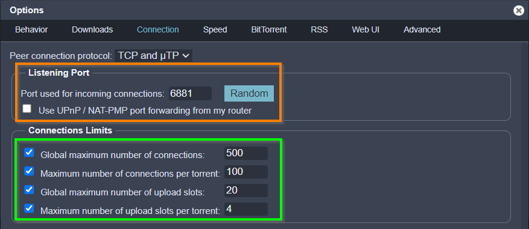
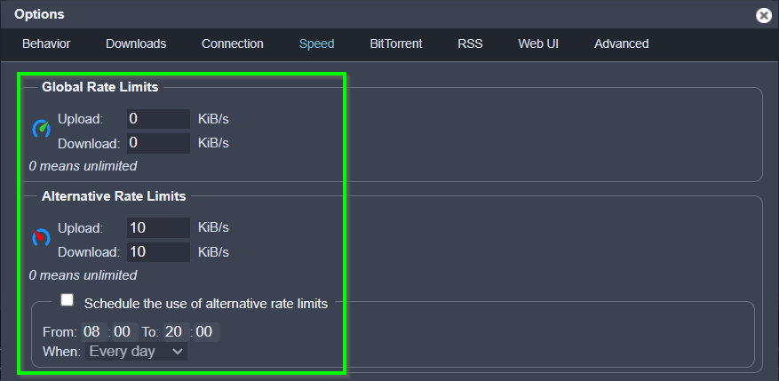
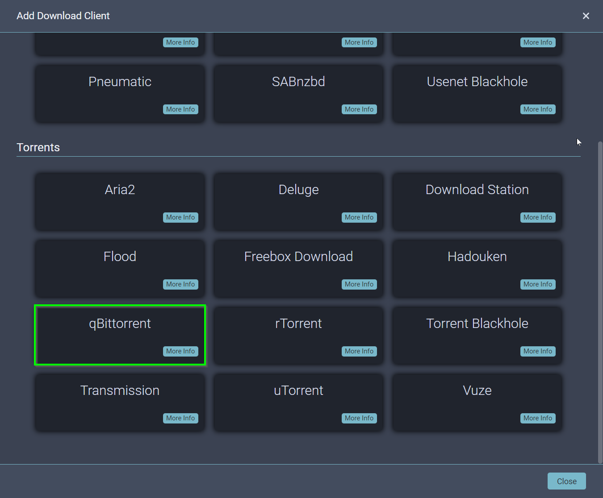

# qBittorent - Torrent Download Client

qBittorrent is a well established open-source BitTorrent download client. qBittorrent features a light footprint, whilst providing all the features you may need. It uses the high-tech libtorrent-rasterbar library, which means greater download and upload speed, as well as excellent support of the latest features in the BitTorrent protocol qBittorrent is fast, stable and provides unicode support as well as many features.

!!! Info "Additional Application Information - External Links"
    - Local WebUI Address: &nbsp; &nbsp;[http://localhost:8200](http://localhost:8200)
    - Application Website: &nbsp; &nbsp; &nbsp;[https://www.qbittorrent.org/](https://www.qbittorrent.org/)
    - Docker Information: &nbsp; &nbsp; &nbsp; [https://docs.linuxserver.io/images/docker-qbittorrent](https://docs.linuxserver.io/images/docker-qbittorrent)


## Login to WebUI

The default username and password in earlier versions of qBittorrent, used to be ==admin== and ==adminadmin== respectively, however the password is now randomly generated every time qBittorrent is started until a permanent password is set.

The randomised password can be viewed in your docker logs by using the following command, then changed to a permanent password once you have logged in.


```
sudo docker logs qbittorrent
```

Log output:

```
The WebUI administrator username is: admin
The WebUI administrator password was not set. A temporary password is provided for this session: hIk7RrW3e9
You should set your own password in program preferences.
```


Go to the [qBittorrent WebUI](http://localhost:8200) and log into the application

<figure markdown>
  { width="300" }
  <figcaption>qBittorrent Login Screen</figcaption>
</figure>

!!! Tip "Set A Permanent Login Password"

    Default Username and Password can be changed by navigating to ==Options Icon== --> ==Web UI== --> ==Authentication==

## Change Default Options

Open the Options dialog and make the following changes in order to the default settings.

### Download Paths

Goto: ==Options Icon== --> ==Downloads==

<figure markdown>
  { width="300" }
  <figcaption>qBittorrent Download Options</figcaption>
</figure>


### Connection Settings

Goto: ==Options Icon== --> ==Connection==

<figure markdown>
  { width="300" }
  <figcaption>qBittorrent Connection Options</figcaption>
</figure>

!!! Warning "Listening Port"

    The listening port of ==6881== should not be changed, its embedded into the qBittorrent Docker image and routes traffic through the secure Gluetun VPN container.
    
    If you need to change the incoming connection port, change the following variable settings in the ==docker-compose.env== file, and redeploy the qBittorrent Docker configuration:

    - `QBIT_PORT_TCP=6881`
    - `QBIT_PORT_UDP=6881`
    
    Once you've changed these settings in the ==docker-compose.env== file and redeployed the configuration, all incoming TCP/UDP connections on the new port numbers will be routed in through the secure Gluetun VPN connection, then Docker will redirect the traffic to the qBittorrent container, which will still be listening on port 6881.

    > NOTE: Under NO circumstances should your change the 6881 port inside the application WebUI, and certainly do not enable UPnP / NAT-PMP. The incoming connection is not coming through your home router, it is coming through the secure Gluetun VPN connection.


!!! Hint "Connection Limits"

    These are the default connection limits, you can tune these yourself once you have set up your qBittorrent client.

    > NOTE: Having too many peer connections and concurrent download sessions may be very ineffficient, and slow down your overall completion rate.
    
    > Changing these settings to high will consume your Internet bandwidth and RAM untilisation on your host computer.

### Download Speed


Goto: ==Options Icon== --> ==Speed==

<figure markdown>
  { width="300" }
  <figcaption>qBittorrent Download Speed</figcaption>
</figure>

!!! Hint "Download Speed"

    These are the default Global and Alternate rate limits, so you can limit the amount of download bandwith you allow qBittorrent to consume.

    If you have a low Internet connection and only want to download while your sleeping, then restrict the ==Global Rate Limits== to a smaller limit, then set the ==Alternate Rate Limits== to a higher number (or "0" for unlimited), then enable the schedule for when the alternate rate limit should be used... i.e. when you're sleeping.

    > NOTE: If you have a poor internet connection, you should set these limits below your ISP Internet connection speed.

    > You can test your Internet speed at [https://www.speedtest.net/](https://www.speedtest.net/), however just remember your qBittorrent connection goes through the secure Gluetun VPN connection, so that will be a little bit slower due to the additional overheads for the VPN encryption.


### BitTorrent Settings


Goto: ==Options Icon== --> ==BitTorrent==

<figure markdown>
  { width="300" }
  <figcaption>qBittorrent BitTorrent Settings</figcaption>
</figure>

!!! Hint "Torrent Queueing"

    Change the ==Torrent Queueing== settings to tune how many active downloads / uploads / torrents your qBittorrent client will run concurrently.

    > NOTE: Having too many peer connections and concurrent download sessions may be very ineffficient, and slow down your overall completion rate.
    
    > Changing these settings to high will consume your Internet bandwidth and RAM untilisation on your host computer.

!!! Warning "Seeding Limits"

    Eanble the ==Seeding Limits== settings so you are able to seed the torrents after you have finished downloading them.

    > NOTE: Many private torrent sites / trackers will ban users if they do not seed files after downloading them, and you will to keep your seeding ratio above a minimum level. Private torrent site seed ratios are different, so keeping a reasonable ratio helps maintain good standing in these sites.


### WebUI Settings


Goto: ==Options Icon== --> ==Web UI==

<figure markdown>
  { width="300" }
  <figcaption>qBittorrent WebUI Settings</figcaption>
</figure>

!!! Warning "Web User Interface (Remote control)"

    The WebUI port of ==8200== should not be changed, its embedded into the qBittorrent Docker image and routes traffic through the secure Gluetun VPN container.
    
    If you need to change the incoming WebUI port, change the following variable settings in the ==docker-compose.env== file, and redeploy the qBittorrent Docker configuration:

    - `WEBUI_PORT_QBITTORRENT=8200`
        
    Once you've changed these settings in the ==docker-compose.env== file and redeployed the configuration, all incoming WebUI connections on the new port number will be routed in through the secure Gluetun VPN connection, then Docker will redirect the traffic to the qBittorrent WebUI, which will still be listening on port 8200.

    > NOTE: Under NO circumstances should your change the 8200 port inside the application WebUI, and certainly do not enable UPnP / NAT-PMP. The incoming connection is not coming through your home router, it is coming through the secure Gluetun VPN connection.

!!! Hint "Authentication"

    Change the default Username and Password in this section, or disable user authentication entirely for clients on the localhost or local network.

    > The Docker subnetwork for our media stack is 172.28.10.0/24, as we are going to be setting up a Nginx reverse proxy with secure authencation throught the SWAG / Cloudflare connection, we can add this address into the authentication bypass, as SWAG / Cloudflare Zero Trust will handle authentication and authorisation into your home network

!!! Hint "Use alternative Web UI"

    ==Themepark Themes== have been enabled in the qBittorrent YAML file, you can disable the theme there, or change the theme by setting the following variable in the ==docker-compose.env== environment file, and redeploying the qBittorrent image in Docker.

    - `TP_THEME=nord`


## Download Categories

When setting up our media libraries and folders, its important to store certain media types in their own folders, so each of the applications can then be set up to manage, rename and fetch meta data, depending on the media type... i.e. movies, TV shows (series), music etc.. in each of the folders.

To help control the management of media files, we use "download categories" in the Torrent / Usenet download clients, which are then linked to certain folders, so media in the same categories are downloaded into the correct folders, so the *ARR Media Library Managers and Jellyfin can manage the media after its been downloaded.

For example, when a movie is downloaded by qBittorrent, it is assigned the ==movie== category and will be downloaded into the folder ==/data/torrents/movies== inside the qBittorrent Docker container, which is actually mounted on the localhost filesystem in the ==FOLDER_FOR_MEDIA/torrents/movies== folder.

Once the download has been completed, qBittorrent tells the *ARR Media Library Manager responisble for ==movies== it has completed (which is "Radarr"), then Radarr moves the file into its own folder ==/data/media/movies==, which is actually mounted on the localhost filesystem in the ==FOLDER_FOR_MEDIA/media/movies== folder.


Goto: Right click ==Categories== --> ==Add Category==

<figure markdown>
  { width="300" }
  <figcaption>qBittorrent Add Category - Step 1</figcaption>
</figure>

!!! Warning "Warning: Category Names and Save Paths Are Case Senstive"

    ==Category Names== and ==Save Paths== are case senstive and must be added in lower case, to match the underlaying Linux filesystem inside the Docker images, and / or, the localhost, and also for communication between the different applications.

Goto: ==Options Icon== --> ==Downloads==

Create a new category for each folder located in the `/data/torrents` folder, except for the ==complete== and ==incomplete== folders, as these are working folders, not specifically set up to manage categories.

Refer to the host / container folder mapping diagram, which was set up during preparation: [Docker Host / Container Folder Mapping](../prep/folders.md#folder-mappings-between-host-and-docker-containers)

<figure markdown>
  { width="300" }
  <figcaption>qBittorrent Add Category - Step 2</figcaption>
</figure>

!!! Hint "Save Path"

    ==Save Path== needs to have the full path and category name as listed on the container's filesystem.

    The container's filesystem is mapped to the Docker host's filesystem, so `/data/torrents/anime` will map to `FOLDER_FOR_MEDIA/torrents/anime` on the Docker host.

Continue to add the following categories:

<figure markdown>
  { width="300" }
  <figcaption>qBittorrent Add Category - Step 3</figcaption>
</figure>


!!! Warning "Categories Failing To Sort Into Correct Folders"

    If files are being downloaded by the *ARR Media Library Managers and they are not being sorted correctly by categories and folders, check the following setting on the Downloads Options page:

    - ==Default Torrent Management Mode:==  `Automatic`

## Test Secure Connection

As the Gluetun container is providing an encrypted VPN tunnel for the entire Docker stack, its important to first check the VPN is providing privacy / obscurity for your Internet connection and torrent traffic.

From any computer in your network, you will be able to see what the IP Address for your Internet connection is by going to [ifconfig.io](http://ifconfig.io)  

Now log onto your Docker host and attach the console to the qBittorrent container using the following command:

``` bash
sudo docker exec -it qbittorrent bash
```

!!! Note "Connecting To qBittorrent Container with Portainer"

    You can also connect to the qBittorrent container using Portainer, by selecting the container you with to connect to, then select `>_ Console`


Once you have successfully connected to the qBittorrent Docker container, run the following command on the console, to check the IP Address which it is using through the VPN tunnel.

``` bash
curl ifconfig.io
```

The IP address of the remote / secure VPN connection will be displayed. Type `exit` to disconnect from the Docker interactive session.  

> NOTE: If the Gluetun container is not running, or does not have an active VPN connection, then no traffic from any of the Docker containers will be allowed to go out to the Internet; it is all blocked unless a secure VPN tunnel is active through Gluetun VPN.  


## Download Torrent Test File

Now qBittorrent is fully configured and secure behind the Gluetun VPN, you should check downloads are working correctly, by downloading a simple Torrent test file.  


### Manual Watch Download

Head over to the BitTorrent download page at Ubuntu [https://ubuntu.com/download/alternative-downloads](https://ubuntu.com/download/alternative-downloads) and download the Ubuntu server ".torrent" file to your computer, then copy the ".torrent" file into copy it into the ==FOLDER_FOR_MEDIA/watch== folder on the Docker host, which is mapped to the qBittorrent container folder ==/data/watch==.  

As qBittorrent is monitoring the ==/data/watch== folder inside the container for incoming ".torrent" files, the torrent download will start immediately after the torrent file has been copied. Once completed, the downloaded torrent will be moved to the ==/data/torrents/complete== folder, as no category was provided using the manual download step (==FOLDER_FOR_MEDIA/torrents/complete==).  

This is a good process if you need to use qBittorrent to manually download torrent files.  

### Download Link with Category

You can also download torrents by copying the Download URL or Magnet Link address of the torrent, and clicking on the "Add Torrent Link" button.

Paste the link into the "Download URL or Magnet Link address" field, and select the category which best suits the torrent. In this case, we'll select one of the other torrent download links from the Ubuntu BitTorrent download page, select the "==software==" Category, then select ==Download==.  

<figure markdown>
  { width="300" }
  <figcaption>qBittorrent Completed Downloads</figcaption>
</figure>

If you inspect the completed torrent downloads, you will notice the manual download was not association with a category and was moved into the ==/data/torrents== directory, while the second download was assigned a category and was moved into the ==/data/torrents/software== directory.

The downloaded test torrents can now be safely deleted using the WebUI.

## Add qBittorent to *ARR Apps


<figure markdown>
  { width="300" }
  <figcaption>qBittorrent Add Downloader to *ARR Applications</figcaption>
</figure>


<figure markdown>
  { width="300" }
  <figcaption>qBittorrent Edit Download Client</figcaption>
</figure>


| *ARR Application | Add Downloader Page | Default Category |
|------------------|---------------------|-------------------|
|Prowlarr: |  [http://localhost:9696/settings/downloadclients](http://localhost:9696/settings/downloadclients) | prowlarr |
|Radarr:   |  [http://localhost:7878/settings/downloadclients](http://localhost:7878/settings/downloadclients) | movies   |
|Sonarr:   |  [http://localhost:8989/settings/downloadclients](http://localhost:8989/settings/downloadclients) | series   |
|Lidarr:   |  [http://localhost:8686/settings/downloadclients](http://localhost:8686/settings/downloadclients) | music    |
|Readarr:  |  [http://localhost:8787/settings/downloadclients](http://localhost:8787/settings/downloadclients) | books    |
|Whisparr: |  [http://localhost:6969/settings/downloadclients](http://localhost:6969/settings/downloadclients) | xxx      |
|Mylar:    |  [http://localhost:8090/config#tabs-3](http://localhost:8090/config#tabs-3) | comics |


<figure markdown>
  { width="300" }
  <figcaption>Mylar Add qBittorrent Download Client</figcaption>
</figure>


