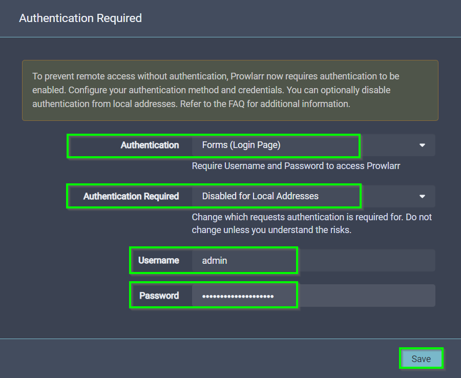
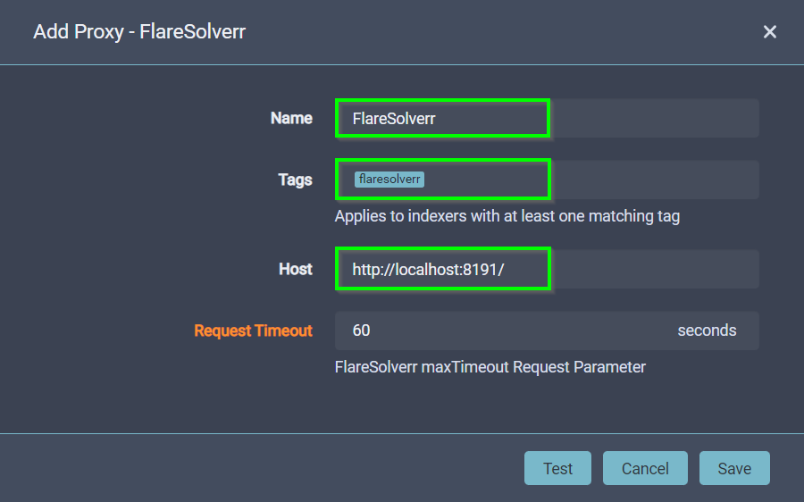
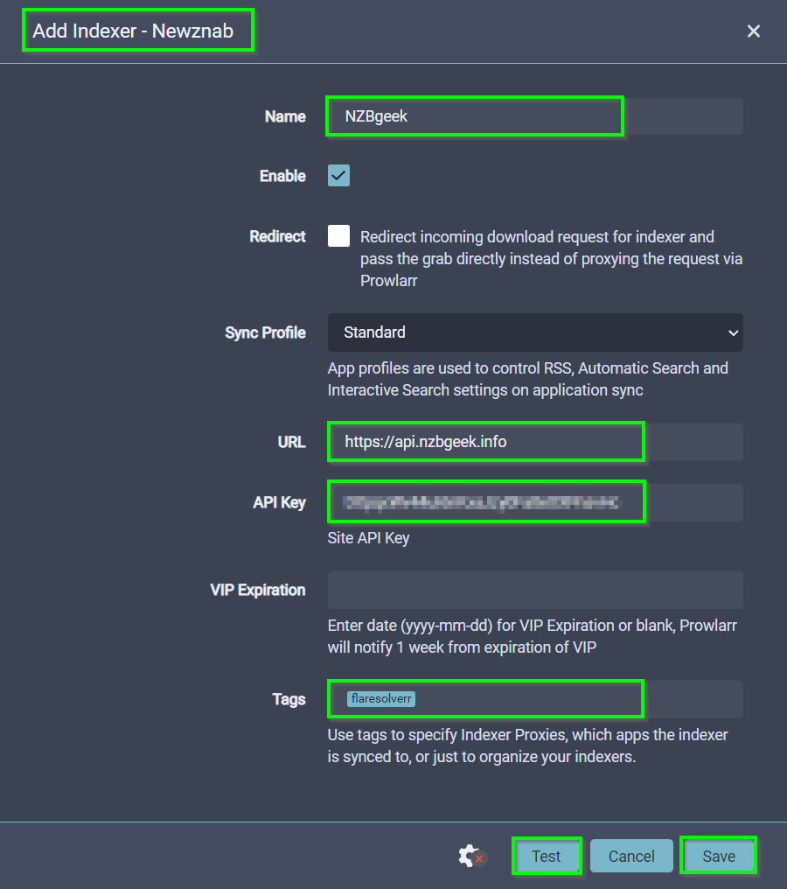
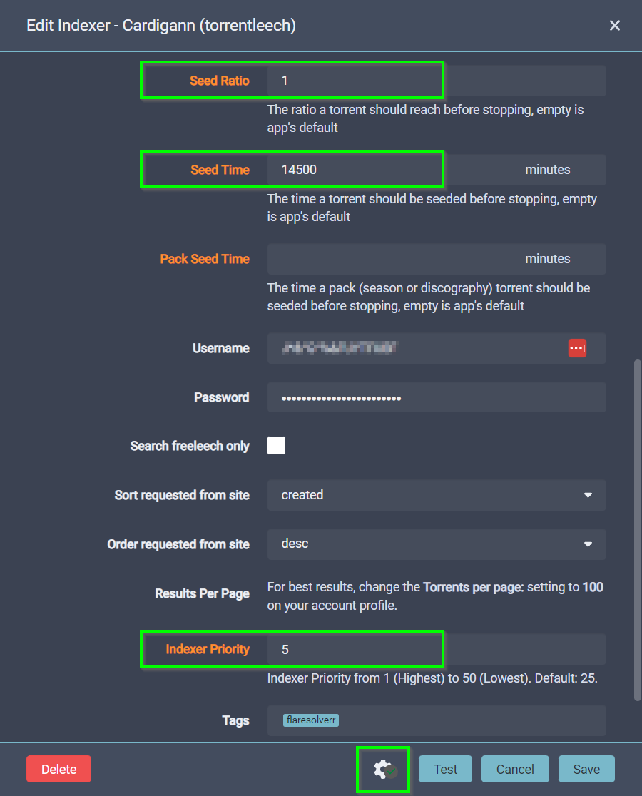
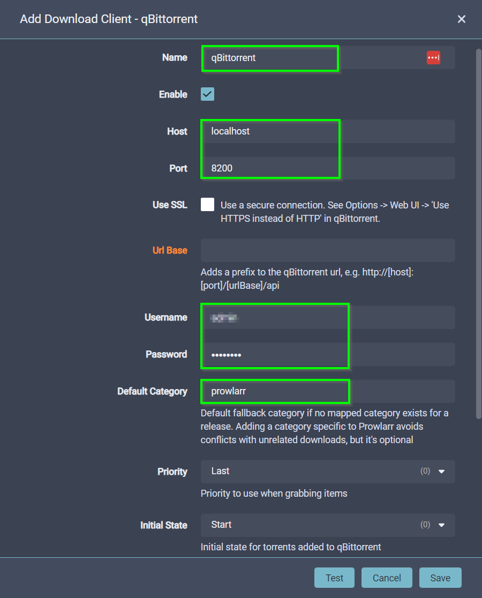
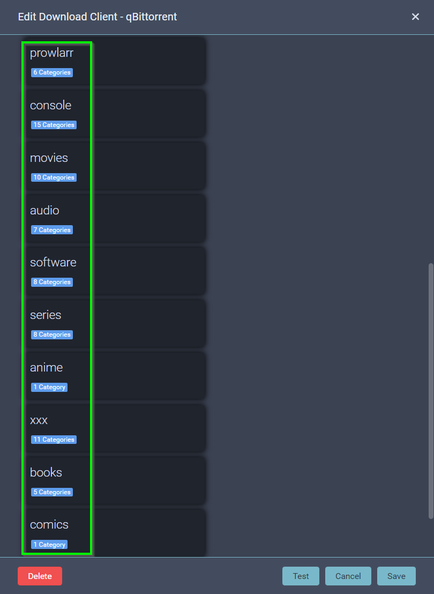
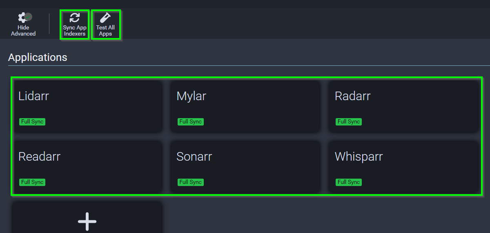
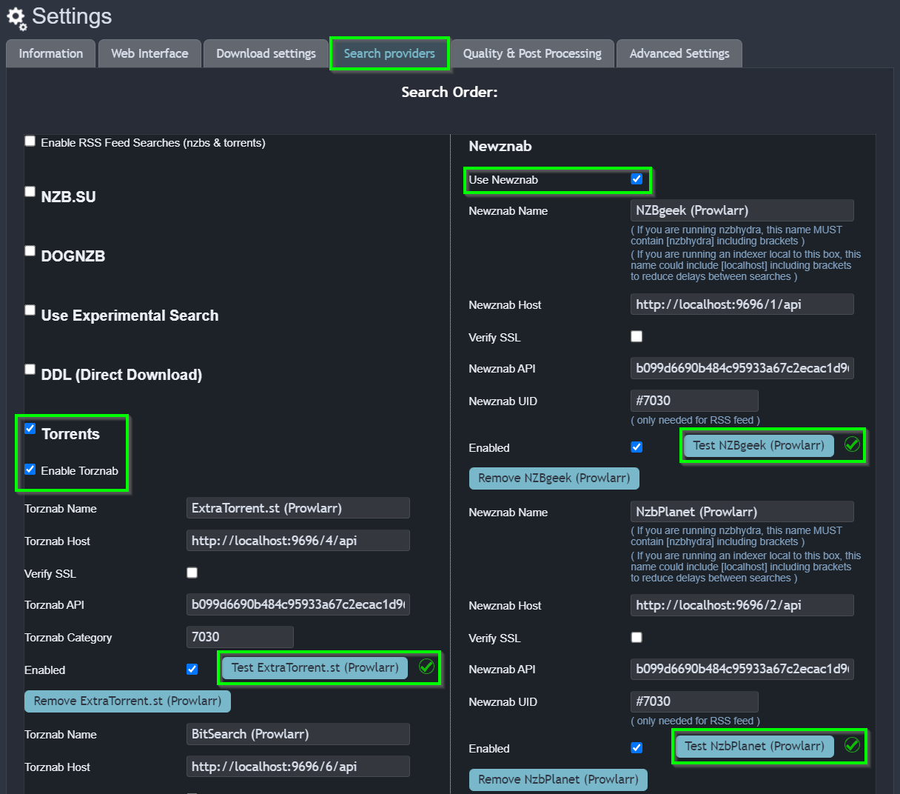
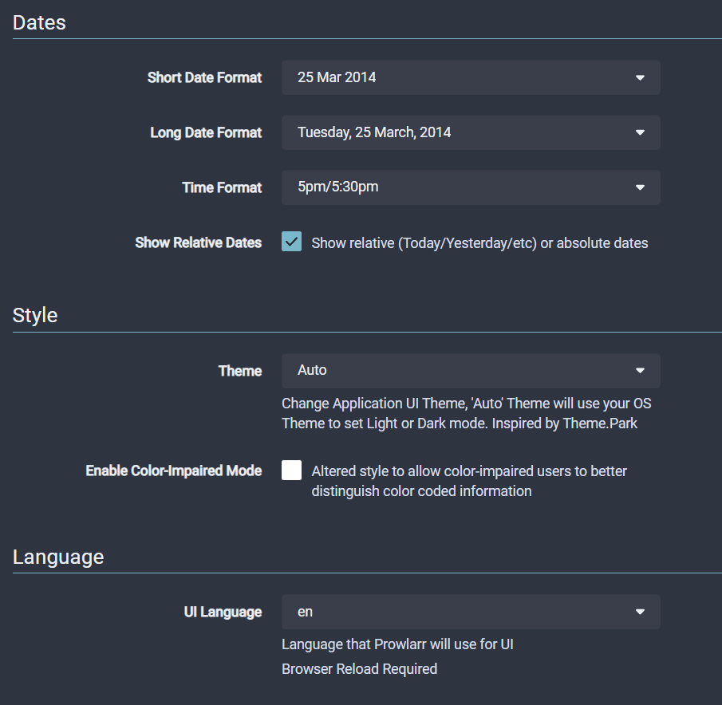

# Prowlarr - Index Search Manager

Prowlarr is a indexer manager/proxy built on the popular arr .net/reactjs base stack to integrate with your various PVR apps. Prowlarr supports both Torrent Trackers and Usenet Indexers. It integrates seamlessly with Sonarr, Radarr, Lidarr, Readarr, and Whisparr offering complete management of your indexers with no per app Indexer setup required (Prowlarr does it all).

!!! Danger "Warning: &nbsp; &nbsp; &nbsp; Page Under Development"

    This page is still under development and may not have accurate information, and should be considered incomplete / inaccurate until this notice is removed.

!!! Info "Additional Application Information - External Links"
    - Local WebUI Address: &nbsp; &nbsp;[http://localhost:9696](http://localhost:9696)
    - Application Website: &nbsp; &nbsp; &nbsp;[https://wiki.servarr.com/prowlarr](https://wiki.servarr.com/prowlarr)
    - Docker Information: &nbsp; &nbsp; &nbsp; [https://docs.linuxserver.io/images/docker-prowlarr](https://docs.linuxserver.io/images/docker-prowlarr)

## Authentication Options

Go to the [Prowlarr WebUI](http://localhost:9696). If this is the first time using Prowlarr, you will be presented with an ==Authentication Required== dialog, as Prowlarr now allows admins to prevent unauthorised access to the application. You can select ==Forms (Login Page)== --> ==Disabled for Local Address== --> Add ==Username== and ==Password== --> ==Save== to continue.

<figure markdown>
  { width="300" }
  <figcaption>Prowlarr Authenication Options</figcaption>
</figure>

!!! Notice "Change Password Options Afterwards"

    If you have set up username / password authentication and cannot log into Prowlarr, or you just want to simply disable authentication all together, you can follow the details on the Prowlarr Wiki page: [https://wiki.servarr.com/prowlarr/faq#can-i-disable-forced-authentication](https://wiki.servarr.com/prowlarr/faq#can-i-disable-forced-authentication).

## Configuring FlareSolverr

Select ==Settings== --> ==Indexer Proxies== --> ==+== (Plus Button)

<figure markdown>
  { width="300" }
  <figcaption>Prowlarr Add Indexer Proxy</figcaption>
</figure>

<figure markdown>
  { width="300" }
  <figcaption>Prowlarr Add FlareSolverr Proxy</figcaption>
</figure>

<figure markdown>
  { width="300" }
  <figcaption>Prowlarr FlareSolverr Proxy List</figcaption>
</figure>

## Adding Indexers

Prowlarr is an Index Search Server, which means it needs to connect Torrent and Usenet Indexers on the Internet, and send search requests out the these indexers, which will provide any search results back to 

Select ==Indexers== --> ==Add Indexer==

<figure markdown>
  { width="300" }
  <figcaption>Prowlarr Add Indexer</figcaption>
</figure>

### Add Torrent Indexers

<figure markdown>
  { width="300" }
  <figcaption>Prowlarr Add NZB Indexer</figcaption>
</figure>

!!! Success

    Add some information about ratios and seeding days

### Add Usenet Indexers

<figure markdown>
  { width="300" }
  <figcaption>Prowlarr Add Torrent Indexer</figcaption>
</figure>

### Advanced Indexer Settings

<figure markdown>
  { width="300" }
  <figcaption>Prowlarr Test Search Indexer</figcaption>
</figure>

!!! Note

    Add something about search priority

<figure markdown>
  { width="300" }
  <figcaption>Prowlarr Indexer Listing</figcaption>
</figure>

### Test Search Index

<figure markdown>
  { width="300" }
  <figcaption>Prowlarr Test Search Indexer</figcaption>
</figure>

## Add Download Clients

### Add Torrent Downloader

If you've already followed the qBittorent configuration guide, you may have already added the qBittorent download client to all of your *ARR Media Applications. However, Prowlarr needs to be configured with some additional settings, so you can automate downloading of certain media categories, into the correct download folders, so they are managed by the correct *ARR Media Library Managers.

Add the qBittorrent download client to Prowlarr: ==Prowlarr== --> ==Settings== --> ==Download Clients==.

<figure markdown>
  { width="300" }
  <figcaption>Prowlarr Add qBittorrent Download Client</figcaption>
</figure>

Scroll down the bottom of the ==Edit Download Client== dialog box and press the ==+== (plus) button in ==Mapped Categories== to map multiple categories into your main download categories.

<figure markdown>
  { width="300" }
  <figcaption>qBittorrent Edit Download Category Mappings</figcaption>
</figure>

Add each of the ==Download Client Categories== listed in the table below, and select the tick boxes next to each of the ==Mapped Categories== to set up the automatic download mappings.

| Download Client Category | Mapped Categories | Group ID |
|--------------------------|-------------------|---------:|
| prowlarr      | Other                                       |    (0) | 
| prowlarr      | &nbsp; &nbsp; &nbsp; Other/Misc             |   (10) | 
| prowlarr      | &nbsp; &nbsp; &nbsp; Other/Hashed           |   (20) | 
| console       | Console                                     | (1000) | 
| console       | &nbsp; &nbsp; &nbsp; Console/NDS            | (1010) | 
| console       | &nbsp; &nbsp; &nbsp; Console/PSP            | (1020) | 
| console       | &nbsp; &nbsp; &nbsp; Console/Wii            | (1030) | 
| console       | &nbsp; &nbsp; &nbsp; Console/XBox           | (1040) | 
| console       | &nbsp; &nbsp; &nbsp; Console/XBox 360       | (1050) | 
| console       | &nbsp; &nbsp; &nbsp; Console/Wiiware        | (1060) | 
| console       | &nbsp; &nbsp; &nbsp; Console/XBox 360 DLC   | (1070) | 
| console       | &nbsp; &nbsp; &nbsp; Console/PS3            | (1080) | 
| console       | &nbsp; &nbsp; &nbsp; Console/Other          | (1090) | 
| console       | &nbsp; &nbsp; &nbsp; Console/3DS            | (1110) | 
| console       | &nbsp; &nbsp; &nbsp; Console/PS Vita        | (1120) | 
| console       | &nbsp; &nbsp; &nbsp; Console/WiiU           | (1130) | 
| console       | &nbsp; &nbsp; &nbsp; Console/XBox One       | (1140) | 
| console       | &nbsp; &nbsp; &nbsp; Console/PS4            | (1180) | 
| movies        | Movies                                      | (2000) | 
| movies        | &nbsp; &nbsp; &nbsp; Movies/Foreign         | (2010) | 
| movies        | &nbsp; &nbsp; &nbsp; Movies/Other           | (2020) | 
| movies        | &nbsp; &nbsp; &nbsp; Movies/SD              | (2030) | 
| movies        | &nbsp; &nbsp; &nbsp; Movies/HD              | (2040) | 
| movies        | &nbsp; &nbsp; &nbsp; Movies/UHD             | (2045) | 
| movies        | &nbsp; &nbsp; &nbsp; Movies/BluRay          | (2050) | 
| movies        | &nbsp; &nbsp; &nbsp; Movies/3D              | (2060) | 
| movies        | &nbsp; &nbsp; &nbsp; Movies/DVD             | (2070) | 
| movies        | &nbsp; &nbsp; &nbsp; Movies/WEB-DL          | (2080) | 
| audio         | Audio                                       | (3000) | 
| audio         | &nbsp; &nbsp; &nbsp; Audio/MP3              | (3010) | 
| audio         | &nbsp; &nbsp; &nbsp; Audio/Video            | (3020) | 
| audio         | &nbsp; &nbsp; &nbsp; Audio/Audiobook        | (3030) | 
| audio         | &nbsp; &nbsp; &nbsp; Audio/Lossless         | (3040) | 
| audio         | &nbsp; &nbsp; &nbsp; Audio/Other            | (3050) | 
| audio         | &nbsp; &nbsp; &nbsp; udio/Foreign           | (3060) | 
| software      | PC                                          | (4000) | 
| software      | &nbsp; &nbsp; &nbsp; PC/0day                | (4010) | 
| software      | &nbsp; &nbsp; &nbsp; PC/ISO                 | (4020) | 
| software      | &nbsp; &nbsp; &nbsp; PC/Mac                 | (4030) | 
| software      | &nbsp; &nbsp; &nbsp; PC/Mobile-Other        | (4040) | 
| software      | &nbsp; &nbsp; &nbsp; PC/Games               | (4050) | 
| software      | &nbsp; &nbsp; &nbsp; PC/Mobile-iOS          | (4060) | 
| software      | &nbsp; &nbsp; &nbsp; PC/Mobile-Android      | (4070) | 
| series        | TV                                          | (5000) | 
| series        | &nbsp; &nbsp; &nbsp; TV/WEB-DL              | (5010) | 
| series        | &nbsp; &nbsp; &nbsp; TV/Foreign             | (5020) | 
| series        | &nbsp; &nbsp; &nbsp; TV/SD                  | (5030) | 
| series        | &nbsp; &nbsp; &nbsp; TV/HD                  | (5040) | 
| series        | &nbsp; &nbsp; &nbsp; TV/UHD                 | (5045) | 
| series        | &nbsp; &nbsp; &nbsp; TV/Other               | (5050) | 
| series        | &nbsp; &nbsp; &nbsp; TV/Sport               | (5060) | 
| anime         | &nbsp; &nbsp; &nbsp; TV/Anime               | (5070) | 
| series        | &nbsp; &nbsp; &nbsp; TV/Documentary         | (5080) | 
| xxx           | XXX                                         | (6000) | 
| xxx           | &nbsp; &nbsp; &nbsp; XXX/DVD                | (6010) | 
| xxx           | &nbsp; &nbsp; &nbsp; XXX/WMV                | (6020) | 
| xxx           | &nbsp; &nbsp; &nbsp; XXX/XviD               | (6030) | 
| xxx           | &nbsp; &nbsp; &nbsp; XXX/x264               | (6040) | 
| xxx           | &nbsp; &nbsp; &nbsp; XXX/UHD                | (6045) | 
| xxx           | &nbsp; &nbsp; &nbsp; XXX/Pack               | (6050) | 
| xxx           | &nbsp; &nbsp; &nbsp; XXX/ImageSet           | (6060) | 
| xxx           | &nbsp; &nbsp; &nbsp; XXX/Other              | (6070) | 
| xxx           | &nbsp; &nbsp; &nbsp; XXX/SD                 | (6080) | 
| xxx           | &nbsp; &nbsp; &nbsp; XXX/WEB-DL             | (6090) | 
| books         | Books                                       | (7000) | 
| books         | &nbsp; &nbsp; &nbsp; Books/Mags             | (7010) | 
| books         | &nbsp; &nbsp; &nbsp; Books/EBook            | (7020) | 
| comics        | &nbsp; &nbsp; &nbsp; Books/Comics           | (7030) | 
| books         | &nbsp; &nbsp; &nbsp; Books/Technical        | (7040) | 
| books         | &nbsp; &nbsp; &nbsp; Books/Other            | (7050) | 
| books         | &nbsp; &nbsp; &nbsp; Books/Foreign          | (7060) | 
| prowlarr      | Other                                       | (8000) | 
| prowlarr      | &nbsp; &nbsp; &nbsp; Other/Misc             | (8010) | 
| prowlarr      | &nbsp; &nbsp; &nbsp; Other/Hashed           | (8020) | 

Once you have added all of the mapped categories, the config should look like this:

<figure markdown>
  { width="300" }
  <figcaption>qBittorrent List Download Category Mappings</figcaption>
</figure>

### Add Usenet Downloader

If you've already followed the SABnzbd configuration guide, you may have already added the SABnzbd download client to all of your *ARR Media Applications. However, Prowlarr needs to be configured with some additional settings, so you can automate downloading of certain media categories, into the correct download folders, so they are managed by the correct *ARR Media Library Managers.

Add the SABnzbd download client to Prowlarr: ==Prowlarr== --> ==Settings== --> ==Download Clients==.

<figure markdown>
  { width="300" }
  <figcaption>Prowlarr Add SABnzbd Download Client</figcaption>
</figure>

Scroll down the bottom of the ==Edit Download Client== dialog box and press the ==+== (plus) button in ==Mapped Categories== to map multiple categories into your main download categories.

<figure markdown>
  { width="300" }
  <figcaption>SABnzbd Edit Download Category Mappings</figcaption>
</figure>

Add each of the ==Download Client Categories== listed in the table below, and select the tick boxes next to each of the ==Mapped Categories== to set up the automatic download mappings.

Once you have added all of the mapped categories, the config should look like this:

<figure markdown>
  { width="300" }
  <figcaption>SABnzbd List Download Category Mappings</figcaption>
</figure>

## Connect ARR Apps to Prowlarr

Once Prowlarr is configured with all the Torrent and Usenet indexers, it needs to be connected to all of the other *ARR Media Library Managers (Radarr / Sonarr / Readarr), so they can all use Prowlarr as the master index manager.

Add *ARR applications: ==Prowlarr== --> ==Settings== --> ==Apps== then add each of the applications.

<figure markdown>
  { width="300" }
  <figcaption>Prowlarr Connect ARR Applications</figcaption>
</figure>

[http://localhost:9696/settings/general](http://localhost:9696/settings/general)

| Library Manager | Server Address | Retrieve API Key |
|-----------------|----------------|------------------|
| Prowlarr  | http://localhost:9696 | |
| Radarr    | http://localhost:7878 | [http://localhost:7878/settings/general](http://localhost:7878/settings/general) |
| Sonarr    | http://localhost:8989 | [http://localhost:8989/settings/general](http://localhost:8989/settings/general) |
| Readarr   | http://localhost:8787 | [http://localhost:8787/settings/general](http://localhost:8787/settings/general) |
| Lidarr    | http://localhost:8686 | [http://localhost:8686/settings/general](http://localhost:8686/settings/general) |
| Whisparr  | http://localhost:6969 | [http://localhost:6969/settings/general](http://localhost:6969/settings/general) |
| Mylar     | http://localhost:8090 | [http://localhost:8090/config#tabs-2](http://localhost:8090/config#tabs-2)       |

<figure markdown>
  { width="300" }
  <figcaption>Prowlarr Connect ARR Applications</figcaption>
</figure>

!!! Warning "Warning: Mylar API Key Needs Manual Activation"

    The API Key for system integration is not enabled by default for Mylar, it needs manual activation the first time use.

    Open Mylar API Key link in the table above, then select ==Web Interface== --> ==Tick "Enable API"== --> ==Generate Mylar API Key== --> ==Save Changes== at bottom of page.

    Copy the API Key from the Mylar portal and copy it into the Prowlarr integration settings above.

<figure markdown>
  { width="300" }
  <figcaption>Prowlarr List ARR Applications</figcaption>
</figure>

### Test Connected ARR Apps

| Library Manager | List of Indexers |
|-----------------|------------------|
| Radarr    | [http://localhost:7878/settings/indexers](http://localhost:7878/settings/indexers) |
| Sonarr    | [http://localhost:8989/settings/indexers](http://localhost:8989/settings/indexers) |
| Readarr   | [http://localhost:8787/settings/indexers](http://localhost:8787/settings/indexers) |
| Lidarr    | [http://localhost:8686/settings/indexers](http://localhost:8686/settings/indexers) |
| Whisparr  | [http://localhost:6969/settings/indexers](http://localhost:6969/settings/indexers) |
| Mylar     | [http://localhost:8090/config#tabs-4](http://localhost:8090/config#tabs-4)       |

<figure markdown>
  { width="300" }
  <figcaption>Radarr List Imported Indexers</figcaption>
</figure>

!!! Warning "Warning: Mylar Imported Indexers Need Manual Activation"

    If Prowlarr has the Mylar API Key, it can synchronise its list of indexers across to Mylar, however Mylar does not list / enable them automatically, it needs manual setup to enable import the Prowlarr indexers for first time use.

    Open Mylar "Search Providers" link in the table above, then select ==Search Providers== --> ==Tick "Use Newznab"== --> ==Tick "Torrents"== --> ==Tick "Enable Torznab"==.

    Test some of the imported Torrent and Usenet indexers, then select ==Save Changes== at the bottom of the page.

<figure markdown>
  { width="300" }
  <figcaption>Mylar Enable Imported Indexers</figcaption>
</figure>

!!! Danger "Notice: Do Not Attempt to Update Library Managers Just Yet"

    At this point in the configuration guide, all of the ARR applications have been integrated with Prowlarr and they are able to do searches and commence downloading media, however each of the applications still need to be configured with media locations and meta data information, please avoid using the ARR Media Library Managed to download media content until you have configured each of the applications, in the relevant guides.

## Additional Configuration Items

### Change Date and Languages

To change the date and language in the WebUI Portal, select ==Settings== --> ==UI==

<figure markdown>
  { width="300" }
  <figcaption>Prowlarr WebUI Date and Language Settings</figcaption>
</figure>

### Miscellaneous Points

