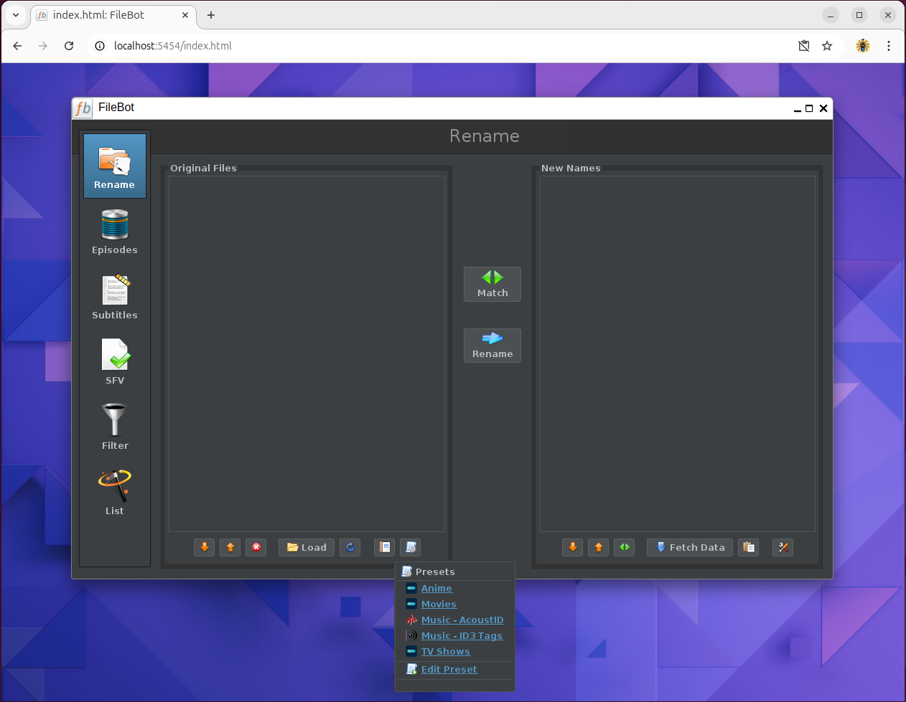

# Preparing Your New Media Library

!!! Warning "Warning: &nbsp; &nbsp; &nbsp; Page Under Development"

    The techical information in this page is correct for MediaStack, however we need to add some additional context soon.


In order for your *ARR Media Library Managers and Jellyfin applications to effectively identify the correct titles and meta data for all of your media, its important you follow the recommended file naming conventions for these applications.

The best way to set up your media library, is to allow the *ARR Media Library Managers to be able to add / remove / change all of the file and folder names based on each title (using the Jellyfin formats), then Jellyfin will be able to easily identify each media object and fetch the relevant meta data and artwork.

The *ARR Media Library Managers already do an excellent job of identifying and renaming media files and folders, however, if you are setting up your media libraries for the first time and your current media files are poorly named, it is recommended to use FileBot to scan and rename everything initially and then import the newly organised media files and folders into the *ARR Library Managers, so they can then continue to manager your media.

!!! Tip "Tip: &nbsp; &nbsp; &nbsp; This Section Is Only For New Media Libraries"

    The following steps


!!! Danger "Warning: &nbsp; &nbsp; &nbsp; Page Under Development"

    This page is still under development and may not have accurate information, and should be considered incomplete / inaccurate until this notice is removed.


## Prepare / rename media library if needed:
If you are setting up your media server and media libraries for the very first time, or your media is very poorly named, it is recommended you use Filebot with the following naming standards below, to initially sort all of your media. Otherwise the Media Library Managers and Jellyfin may not be able to identify your media titles, media art, and subtitles, if the original filenames are of a poor standard.

Change =="D:/Storage"== to suit your needs, however use the same disk as the original media, so it is renamed quickly in place, rather than copied to a different disk or network; this could take a great deal of time to complete depending on size of the libraries / media you are renaming.

>This can be skipped if you have a well organised / structured media library already.

### Filebot Renaming Preset String - TV Shows

``` powershell
/filebot/output/tv/{ny.colon(' - ')} [tmdb-{tmdbid}]/Season {s00}/{ny.colon(' - ')} - {s00e00} - {t}{ " - [$vf, $vc, $ac]" }{'-'+group}
```

### Filebot Renaming Preset String - Anime

``` powershell
/filebot/output/anime/{ny.colon(' - ')} [tmdb-{tmdbid}]/Season {s00}/{ny.colon(' - ')} - {s00e00} - {t}{ " - [$vf, $vc, $ac]" }{'-'+group}
```

### Filebot Renaming Preset String - Movies

``` powershell
/filebot/output/movies/{ny.colon(' - ')} [tmdb-{tmdbid}]/{ny.colon(' - ')}{ " {Edition-$edition}" }{ " - [$vf, $vc, $ac]" }{'-'+group}
```

### Filebot Renaming Preset String - Music ID3 Tags

``` powershell
/filebot/output/music-id3/{albumArtist}/{album} ({y})/{album} CD{dc.pad(2)} - {pi.pad(3)} - {t}
```

### Filebot Renaming Preset String - Music AcoustID

``` powershell
/filebot/output/music-aid/{albumArtist}/{album} ({y})/{album} CD{dc.pad(2)} - {pi.pad(3)} - {t}
```

### Edit Filebot Presets


<figure markdown>
  { width="300" }
  <figcaption>Filebot - Update Preset Naming Conventions</figcaption>
</figure>


``` bash
vi FOLDER_FOR_DATA/filebot/.java/.userPrefs/net/filebot/ui/rename/presets/prefs.xml
```


### Replace contents of the "prefs.xml" with the following XML:

``` xml
<?xml version="1.0" encoding="UTF-8" standalone="no"?>
<!DOCTYPE map SYSTEM "http://java.sun.com/dtd/preferences.dtd">
<map MAP_XML_VERSION="1.0">
  <entry key="1726373382" value="{&quot;@type&quot;:&quot;Preset&quot;,&quot;id&quot;:&quot;1726373382&quot;,&quot;name&quot;:&quot;TV Shows&quot;,&quot;path&quot;:&quot;/filebot/input&quot;,&quot;includes&quot;:&quot;&quot;,&quot;format&quot;:&quot;/filebot/output/tv/{ny.colon(' - ')} [tmdb-{tmdbid}]/Season {s00}/{ny.colon(' - ')} - {s00e00} - {t}{ \&quot; - [$vf, $vc, $ac]\&quot; }{'-'+group}&quot;,&quot;database&quot;:&quot;TheMovieDB::TV&quot;,&quot;sortOrder&quot;:&quot;Airdate&quot;,&quot;matchMode&quot;:&quot;Opportunistic&quot;,&quot;language&quot;:&quot;en&quot;,&quot;action&quot;:&quot;MOVE&quot;}"/>
  <entry key="1726373553" value="{&quot;@type&quot;:&quot;Preset&quot;,&quot;id&quot;:&quot;1726373553&quot;,&quot;name&quot;:&quot;Movies&quot;,&quot;path&quot;:&quot;/filebot/input&quot;,&quot;includes&quot;:&quot;&quot;,&quot;format&quot;:&quot;/filebot/output/movies/{ny.colon(' - ')} [tmdb-{tmdbid}]/{ny.colon(' - ')}{ \&quot; {Edition-$edition}\&quot; }{ \&quot; - [$vf, $vc, $ac]\&quot; }{'-'+group}&quot;,&quot;database&quot;:&quot;TheMovieDB&quot;,&quot;matchMode&quot;:&quot;Opportunistic&quot;,&quot;language&quot;:&quot;en&quot;,&quot;action&quot;:&quot;MOVE&quot;}"/>
  <entry key="1726373781" value="{&quot;@type&quot;:&quot;Preset&quot;,&quot;id&quot;:&quot;1726373781&quot;,&quot;name&quot;:&quot;Anime&quot;,&quot;path&quot;:&quot;/filebot/input&quot;,&quot;includes&quot;:&quot;&quot;,&quot;format&quot;:&quot;/filebot/output/anime/{ny.colon(' - ')} [tmdb-{tmdbid}]/Season {s00}/{ny.colon(' - ')} - {s00e00} - {t}{ \&quot; - [$vf, $vc, $ac]\&quot; }{'-'+group}&quot;,&quot;database&quot;:&quot;TheMovieDB::TV&quot;,&quot;sortOrder&quot;:&quot;Airdate&quot;,&quot;matchMode&quot;:&quot;Opportunistic&quot;,&quot;language&quot;:&quot;en&quot;,&quot;action&quot;:&quot;MOVE&quot;}"/>
  <entry key="1726374488" value="{&quot;@type&quot;:&quot;Preset&quot;,&quot;id&quot;:&quot;1726374488&quot;,&quot;name&quot;:&quot;Music - ID3 Tags&quot;,&quot;path&quot;:&quot;/filebot/input&quot;,&quot;includes&quot;:&quot;&quot;,&quot;format&quot;:&quot;/filebot/output/music-id3/{albumArtist}/{album} ({y})/{album} CD{dc.pad(2)} - {pi.pad(3)} - {t}&quot;,&quot;database&quot;:&quot;ID3&quot;,&quot;action&quot;:&quot;MOVE&quot;}"/>
  <entry key="1726374677" value="{&quot;@type&quot;:&quot;Preset&quot;,&quot;id&quot;:&quot;1726374677&quot;,&quot;name&quot;:&quot;Music - AcoustID&quot;,&quot;path&quot;:&quot;/filebot/input&quot;,&quot;includes&quot;:&quot;&quot;,&quot;format&quot;:&quot;/filebot/output/music-aid/{albumArtist}/{album} ({y})/{album} CD{dc.pad(2)} - {pi.pad(3)} - {t}&quot;,&quot;database&quot;:&quot;AcoustID&quot;,&quot;action&quot;:&quot;MOVE&quot;}"/>
</map>
```

Restart Filebot container for changes to take effect:

``` bash
sudo docker container restart filebot
```

</br>


## *ARR Application File Naming

### Common Settings for All *ARR Apps


<center>

| *ARR Option:                        | Setting:                    |  
|-------------------------------------|-----------------------------|  
| Rename Media File:                  | Yes                         |  
| Replace Illegal Characters:         | Yes                         |  
| Colon Replacement:                  | Replace with Space Dash     |  
| Create empty media folders:         | No                          |  
| Delete empty folders:               | Yes                         |  
| Skip Free Space Check:              | No                          |  
| Minimum Free Space:                 | 250000                      |  
| **Use Hardlinks instead of Copy:**  | **Yes**                     |  
| Import Using Script:                | Optional                    |  
| Import Extra Files:                 | Optional                    |  
| Unmonitor Deleted Media:            | Optional                    |  
| Propers and Repacks:                | Prefer and Upgrade          |  
| Rescan Movie Folder after Refresh:  | Always                      |  
| Set Permissions:                    | Yes                         |  
| Chmod Folder:                       | 775                         |  
|   |   |  
|   |   |  

</center>


### Radarr - Movie Naming  

**Standard Movie Format:**
```
{Movie CleanTitle} {(Release Year)} {Edition-{Edition Tags}} - [{Quality Full}, {MediaInfo VideoCodec}, {Mediainfo AudioCodec}]{-Release Group}
```

**Movie Folder Format:**  
```
{Movie CleanTitle} {(Release Year)} [tmdb-{TmdbId}]
```
</br>  

---
### Sonarr - TV / Anime Naming:  

**Standard Episode Format:**  
```
{Series CleanTitle} ({Series Year}) - S{season:00}E{episode:00} - {Episode CleanTitle} - [{Quality Full}, {MediaInfo VideoCodec}, {Mediainfo AudioCodec}]{-Release Group}
```

**Daily Episode Format:**  
```
{Series CleanTitle} ({Series Year}) - {Air-Date} - {Episode CleanTitle} - [{Quality Full}, {MediaInfo VideoCodec}, {Mediainfo AudioCodec}]{-Release Group}
```

**Anime Episode Format:**  
```
{Series CleanTitle} ({Series Year}) - S{season:00}E{episode:00} - {Episode CleanTitle} - [{Quality Full}, {MediaInfo VideoCodec}, {Mediainfo AudioCodec}]{-Release Group}
```

**Series Folder Format:**  
```
{Series CleanTitle} ({Series Year}) [tmdb-{TmdbId}]
```

**Season Folder Format:**  
```
Season {season:00}
```

**Specials Folder Format:**  
```
Specials  
```

**Multi Episode Style:**
```
Prefixed Range (S01E01-E03)
```

</br>  

---

### Lidarr - Music Naming:  

**Standard Track Format:**  
```
{Album CleanTitle} ({Release Year})/{Artist CleanName} - {Album CleanTitle} - {track:000} - {Track CleanTitle} - [{MediaInfo AudioCodec}, {MediaInfo AudioChannels}, {MediaInfo AudioBitRate}, {MediaInfo AudioSampleRate}, {MediaInfo AudioBitsPerSample}]{-Release Group}
```

**Multi Disk Track Format:**  
```
{Album CleanTitle} ({Release Year})/{Artist CleanName} - {Album CleanTitle} {Medium Format} {medium:00} - {track:000} - {Track CleanTitle} - [{MediaInfo AudioCodec}, {MediaInfo AudioChannels}, {MediaInfo AudioBitRate}, {MediaInfo AudioSampleRate}, {MediaInfo AudioBitsPerSample}]{-Release Group}
```

**Artist Folder Format:**  
```
{Artist CleanName} (mbid-{Artist MbId})
```

</br>  

---
### Mylar3 - Comic Naming:  

**Folder Format:**  
```
$Series ($Year)
```

**File Format:**  
```
$Series $Annual $Issue ($Year)
```


</br>  

---
### Readarr - ePub Naming:  

**Standard Book Format:**  
```
{Book CleanTitle} ({Release Year})/{Author CleanName} - {Book CleanTitle}{ - Part (PartNumber:00)}{-Release Group}
```

**Author Folder Format:**  
```
{Author CleanName}
```


</br>  

---
### Whisparr - XXX Naming:  

**Standard Episode Format:**  
```
{Site CleanTitle} - {Release-Date} - {Episode CleanTitle} - [{Quality Full}, {MediaInfo VideoCodec}, {Mediainfo AudioCodec}]{-Release Group}
```

**Site Folder Format:**  
```
{Site CleanTitle} (tpdbid-{tpdbId})
```

**Multi Episode Style:**
```
Prefixed Range (S01E01-E03)
```


</br>

# *ARR Application Root Folders


| *ARR Option:  | Setting:           |  
|---------------|--------------------|  
| Radarr:       | /data/media/movies |  
| Sonarr:       | /data/media/anime  |  
| Sonarr:       | /data/media/tv     |  
| Lidarr:       | /data/media/music  |  
| Mylar3:       | /data/media/comics |  
| Readarr:      | /data/media/audio  |  
| Readarr:      | /data/media/books  |  
| Whisparr:     | /data/media/xxx    |  


