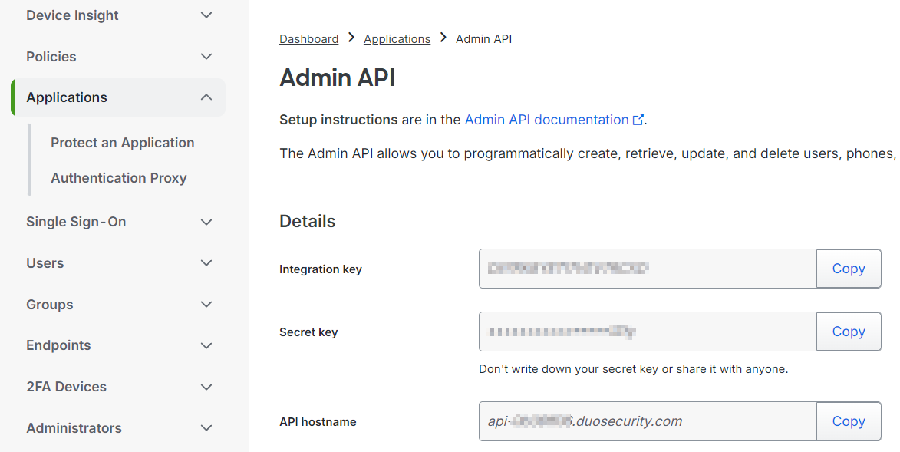
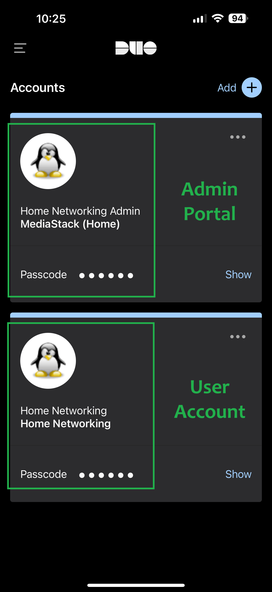

# Authelia

Authelia is an open-source authentication and authorisation (AA) server and portal fulfilling the identity and access management (IAM) role of information security in providing multi-factor authentication and single sign-on (SSO) for your applications via a web portal. It acts as a companion for common reverse proxies, and we will integrate it into the SWAG Nginx Reverse Proxy to manage secure remote access into your home MediaStack network.

!!! Info "Additional Application Information - External Links"  
    - Application Website: &nbsp; &nbsp; &nbsp;[https://www.authelia.com/](https://www.authelia.com/)  
    - Docker Information: &nbsp; &nbsp; &nbsp; [https://hub.docker.com/r/authelia/authelia](https://hub.docker.com/r/authelia/authelia)  

---

## DUO Security (2FA)

Duo Security, a Cisco company, provides multi-factor authentication (MFA) to secure access to applications and data. Duo enhances login security by requiring two or more verification methods - a password and a mobile device or hardware token. This approach protects against unauthorised access and ensures only authorised users access sensitive information. With a user-friendly interface, Duo simplifies MFA implementation across platforms, making it essential for organisations to strengthen security and protect against identity theft and data breaches.  

**Head over to DUO Security, and sign up for a free trial, which allows you to set up 10 users without paying.**

[https://duo.com](https://duo.com)


<figure markdown>
  { width="300" }
  <figcaption>DUO Security - Add User</figcaption>
</figure>


<figure markdown>
  { width="300" }
  <figcaption>DUO Security - Add User</figcaption>
</figure>


<figure markdown>
  { width="300" }
  <figcaption>DUO Security - Add User</figcaption>
</figure>

<figure markdown>
  { width="300" }
  <figcaption>DUO Security - Add User</figcaption>
</figure>


## User Database


Add users into Authelia "users_database.yml" file  
```
vi /mediastackdata/authelia/users_database.yml
```


```
users:
  jane:
    displayname: Jane Doe
    password: $argon2id$v=19$m=65536,t=3,p=4$/yxpBgUJVmRvq0mMIsFUaQ$pGtxdCaI3qkeVGoU+BGSb0pY1SHDxKkclRK5UINfISQ
    email: jane@example.com
    groups: []
  john:
    displayname: John Doe
    password: $argon2id$v=19$m=65536,t=3,p=4$/yxpBgUJVmRvq0mMIsFUaQ$pGtxdCaI3qkeVGoU+BGSb0pY1SHDxKkclRK5UINfISQ
    email: john@example.com
    groups: []
```

```
sudo docker run authelia/authelia:latest authelia crypto hash generate argon2 --password strong_password_to_hash  
```

```
sudo docker run --rm authelia/authelia authelia crypto hash generate --help  
sudo docker run --rm authelia/authelia authelia crypto hash generate --random  
```
Random Password: Lk1rrDRSJjvaZeONRbDvhSL3ObWZnLJWYrFZszTM8l9nptJLt3rjZL84jhYTcHmzJv8bjxiv  
Digest: $argon2id$v=19$m=65536,t=3,p=4$3LNeSdMd8bhnvYkd3v!YhS5ZjQk0qxPait/iagR9PLzfkUHzi6PrYO^0S68Kp6RSiU  


