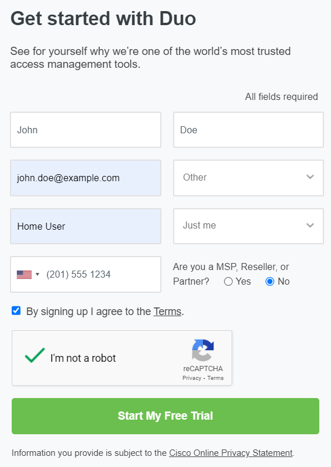
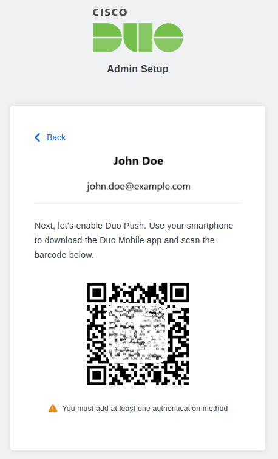
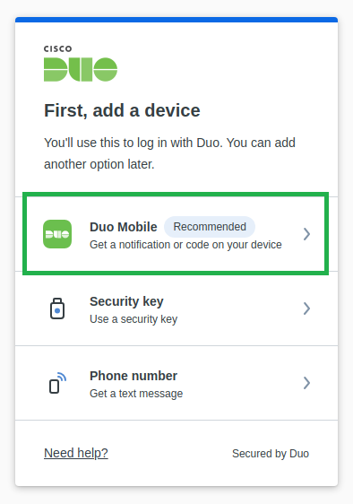
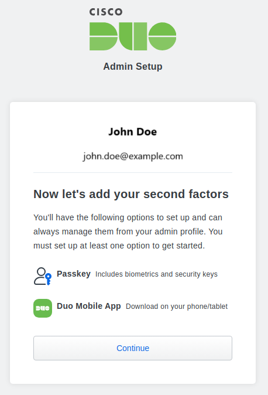
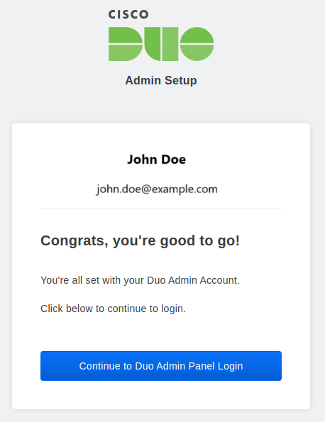
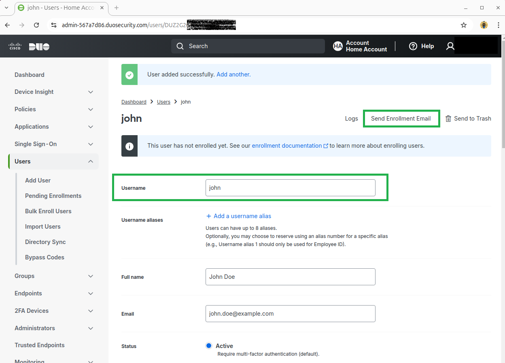
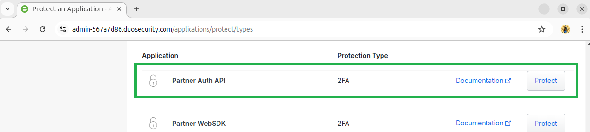
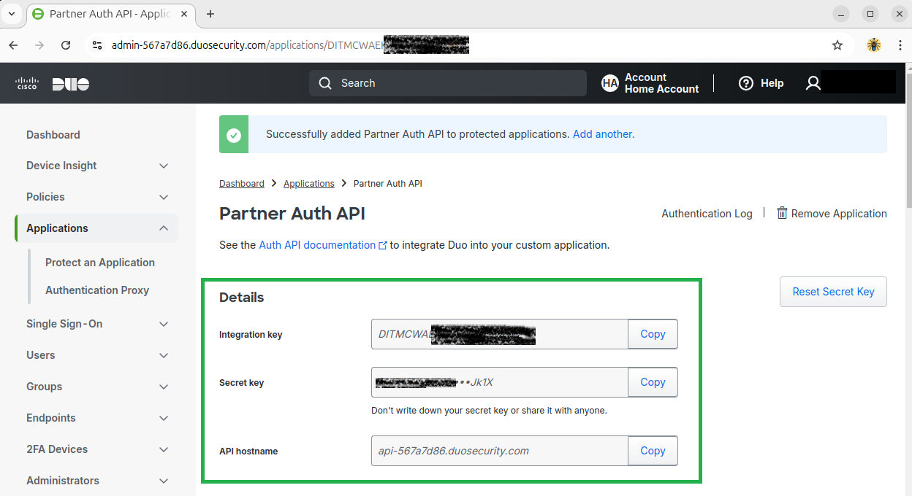

# DUO Security (MFA/2FA)

Duo Security, a Cisco Systems company, provides multi-factor authentication (MFA) to secure access to applications and data. Duo enhances login security by requiring two or more verification methods - a password and a mobile device or hardware token. This approach protects against unauthorised access and ensures only authorised users access sensitive information. With a user-friendly interface, Duo simplifies MFA implementation across platforms, making it essential for organisations and home users to strengthen security and protect against identity theft and data breaches.  

DUO is a great option for MFA, as it provides push notifications to your mobile phone, and the free account, allows people to host up to 10 users, which is an ideal option for home user environments.  

 

## Install DUO Application  

First, we'll install the mobile phone application. Head over to the application store on your mobile phone, and install the "DUO Mobile", by "DUO Security LLC", which we need when we register the free account DUO Security portal.

<figure markdown>
  { width="300" }
  <figcaption>DUO Security - Install Mobile App</figcaption>
</figure>

 

## Register DUO Account

Head over to DUO Security, and sign up for a free trial:  [https://duo.com](https://duo.com){:target="_blank"}

<figure markdown>
  { width="300" }
  <figcaption>DUO Security - Account Signup</figcaption>
</figure>

After registering for a DUO Security account, you will need to check your emails to verify the account, and to scan the QR Code to set up the Administration account for DUO.

<figure markdown>
  { width="300" }
  <figcaption>DUO Security - Scan QR Code to Enroll Device</figcaption>
</figure>

After scanning the QR Code, select "DUO Mobile" to link the application to your DUO Admin portal.

<figure markdown>
  { width="300" }
  <figcaption>DUO Security - Select DUO Mobile</figcaption>
</figure>

Link your DUO Admin portal account to your DUO Mobile App.

<figure markdown>
  { width="300" }
  <figcaption>DUO Security - Enroll Admin Account</figcaption>
</figure>

You will be shown the following message after successfully linking your DUO Security phone app to your DUO Admin Portal.

<figure markdown>
  { width="300" }
  <figcaption>DUO Security - Admin Account Enrolled</figcaption>
</figure>

## Enroll User Accounts

Now that you have Admin access to the DUO Security portal, you can start enrolling your users.

> Your users will also need to install the "DUO Security" app on their mobile devices.
>
> NOTE: The "username" must be unique for each user, and will be the same "username" we add to Authelia in the next chapter, so they match between both applications.

<figure markdown>
  { width="300" }
  <figcaption>DUO Security - Register User Account</figcaption>
</figure>

> NOTE: Afte creating each user account, you must press "Send Enrollment Email", so they are emailed the QR Code needed to set up their DUO Security Mobile apps and link to your DUO Security account.

You can see the status of all users, and check whether they're successfully linked their Mobile applications to their accounts, and when they logged in to your mobile applications last.

<figure markdown>
  { width="300" }
  <figcaption>DUO Security - User Accounts in Portal</figcaption>
</figure>

The owner of the DUO Security admin portal will have a Token installed for when logging into the portal, and a second Token if they have registered for a basic user account, for remote access to your MediaStack environment.

Basic users you enroll, will only have the one Token installed in DUO Security app.

<figure markdown>
  { width="300" }
  <figcaption>DUO Security - Mobile App</figcaption>
</figure>

## DUO API Settings

Now that we have the DUO Admin portal set up, and we have registered / emailed our users, its time to link DUO Security to Authelia, so the Web Application stack knows how to integrate into the MFA API.

In the Admin Portal, select "Applications" --> "Protect An Application" --> "Partnet Auth API".

<figure markdown>
  { width="300" }
  <figcaption>DUO Security - Choose Partner Auth API</figcaption>
</figure>

DUO Security will generate the API Keys needed to link with Authelia.

Accept all the default settings, and hit "Save" at the bottom.

<figure markdown>
  { width="300" }
  <figcaption>DUO Security - Auth API Settings for Authelia</figcaption>
</figure>

